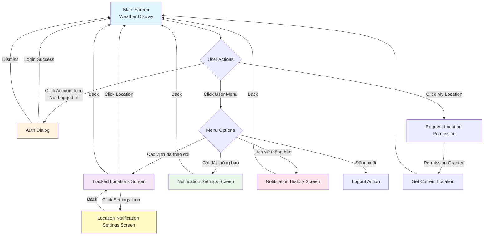
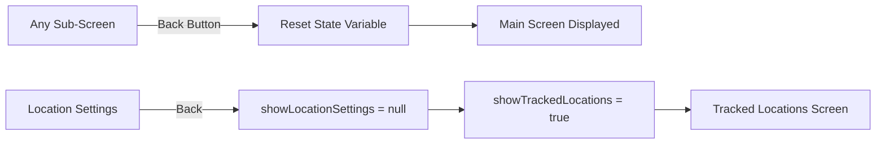
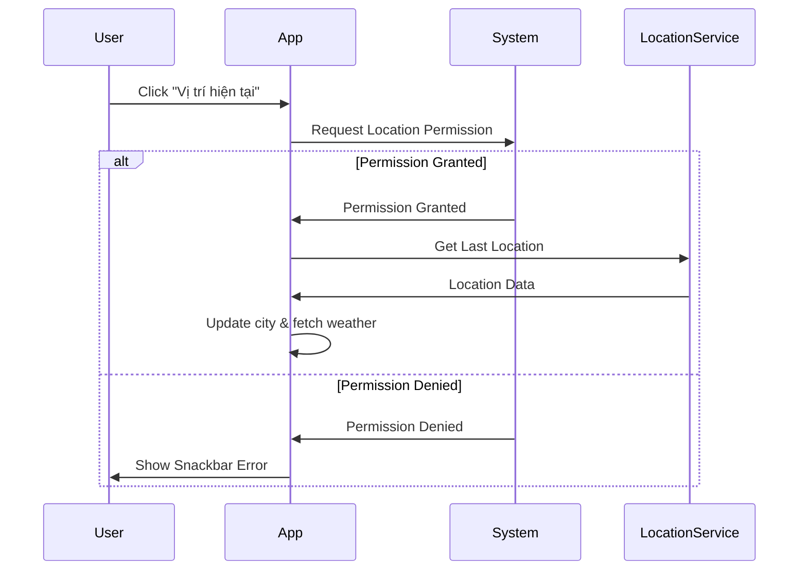
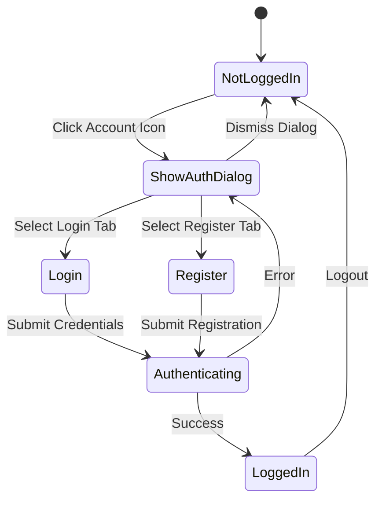

# Navigation Documentation - Android App

## Tổng quan

Ứng dụng Dự báo Thời tiết sử dụng **State-Based Navigation** thay vì Jetpack Navigation Component. Navigation được quản lý thông qua các state variables trong `MainActivity` và điều khiển bằng cách thay đổi state để hiển thị các màn hình khác nhau.

## Kiến trúc Navigation

### Navigation Pattern

Ứng dụng sử dụng pattern **Conditional Rendering** với Scaffold:
- Một `Scaffold` duy nhất trong `MainActivity`
- Các màn hình được render có điều kiện dựa trên state
- `BackHandler` được sử dụng để xử lý nút back
- State được quản lý bằng `remember { mutableStateOf() }`

### Navigation State Variables

```kotlin
// Trong WeatherApp composable
var showAuthDialog by remember { mutableStateOf(false) }
var showTrackedLocations by remember { mutableStateOf(false) }
var showNotificationSettings by remember { mutableStateOf(false) }
var showNotificationHistory by remember { mutableStateOf(false) }
var showLocationSettings by remember { mutableStateOf<Pair<Int, String>?>(null) }
```

## Navigation Graph



## Màn hình và Routes

### 1. Main Screen (Weather Display)
**State:** Mặc định khi không có state nào khác được set

**Mô tả:** Màn hình chính hiển thị thông tin thời tiết

**Components:**
- `WeatherScreen` composable
- Search bar để tìm thành phố
- Hiển thị thông tin thời tiết hiện tại
- Dự báo theo ngày và theo giờ
- Biểu đồ thời tiết (Rain, UV, AQI)
- Cảnh báo thời tiết (nếu có)
- Lời khuyên AI (nếu có)

**Navigation từ màn hình này:**
- Click icon tài khoản → Auth Dialog (nếu chưa đăng nhập)
- Click user menu → Dropdown menu với các options
- Click "Theo dõi vị trí này" → Track location action

**Parameters:** Không có

---

### 2. Auth Dialog
**State:** `showAuthDialog = true`

**Mô tả:** Dialog xác thực người dùng (đăng nhập/đăng ký)

**Components:**
- `AuthScreen` composable
- Tab chuyển đổi giữa Login và Register
- Form nhập username và password
- Xử lý authentication state

**Navigation:**
- Dismiss dialog → Main Screen
- Login success → Main Screen (với user state updated)

**Parameters:** Không có

**Implementation:**
```kotlin
if (showAuthDialog) {
    Dialog(onDismissRequest = { showAuthDialog = false }) {
        AuthScreen(authViewModel, userViewModel) {
            showAuthDialog = false
        }
    }
}
```

---

### 3. Tracked Locations Screen
**State:** `showTrackedLocations = true`

**Mô tả:** Danh sách các vị trí đã theo dõi của user

**Components:**
- `TrackedLocationsScreen` composable
- LazyColumn hiển thị danh sách locations
- Mỗi location card hiển thị:
  - Tên vị trí
  - Nhiệt độ hiện tại
  - Icon thời tiết
  - Tỉ lệ mưa
  - Tốc độ gió
  - Switch bật/tắt thông báo
  - Nút xóa location

**Navigation:**
- Back button → Main Screen
- Click location card → Main Screen (với city được set)
- Click settings icon → Location Notification Settings Screen
- Click delete → Show delete confirmation dialog

**Parameters:**
- `userId: String` - ID của user hiện tại

**Implementation:**
```kotlin
TrackedLocationsScreen(
    userId = user!!.userId,
    viewModel = viewModel,
    onBackClick = { showTrackedLocations = false },
    onLocationClick = { locationName ->
        city = locationName
        weatherViewModel.getWeather(removeVietnameseAccents(locationName))
        showTrackedLocations = false
    },
    onLocationSettingsClick = { locationId ->
        val location = viewModel.trackedLocations.value?.find { it.id == locationId }
        if (location != null) {
            showLocationSettings = Pair(locationId, location.name)
            showTrackedLocations = false
        }
    }
)
```

---

### 4. Notification Settings Screen
**State:** `showNotificationSettings = true`

**Mô tả:** Cài đặt thông báo chung cho tất cả locations

**Components:**
- `NotificationSettingsScreen` composable
- Toggle bật/tắt thông báo tổng thể
- Chọn loại cảnh báo thời tiết (theo nhóm):
  - Lũ lụt và Mưa
  - Bão và Gió
  - Nhiệt độ
  - Sức khỏe (UV & AQI)
  - Cảnh báo chính thức
- Lịch trình nhận thông báo:
  - Luôn luôn
  - Chỉ ban ngày (6:00 - 22:00)
  - Chỉ khi quan trọng
- Thông báo định kỳ:
  - Tóm tắt buổi sáng (7:00 AM)
  - Dự báo ngày mai (8:00 PM)
  - Tóm tắt tuần (8:00 PM Chủ nhật)
- Widget thời tiết toggle
- Sync button

**Navigation:**
- Back button → Main Screen

**Parameters:**
- `userId: Int` - ID của user (từ ViewModel factory)

**Implementation:**
```kotlin
val viewModel: NotificationSettingsViewModel = viewModel(
    factory = NotificationSettingsViewModelFactory(
        repository = notificationRepository,
        userId = user!!.userId.toInt()
    )
)

NotificationSettingsScreen(
    viewModel = viewModel,
    onBackClick = { showNotificationSettings = false }
)
```

---

### 5. Notification History Screen
**State:** `showNotificationHistory = true`

**Mô tả:** Lịch sử các thông báo đã nhận

**Components:**
- `NotificationHistoryScreen` composable
- LazyColumn hiển thị danh sách notifications
- Mỗi notification item hiển thị:
  - Icon theo loại thông báo
  - Title và body preview
  - Timestamp
  - Priority badge (nếu high priority)
  - Unread indicator
- Filter dialog:
  - Lọc theo loại thông báo
  - Lọc theo khoảng thời gian
- Detail dialog khi click vào notification

**Navigation:**
- Back button → Main Screen
- Click notification → Show detail dialog

**Parameters:**
- `userId: Int` - ID của user (từ ViewModel factory)

**Implementation:**
```kotlin
val viewModel: NotificationHistoryViewModel = viewModel(
    factory = NotificationHistoryViewModelFactory(
        repository = notificationRepository,
        userId = user!!.userId.toInt()
    )
)

NotificationHistoryScreen(
    viewModel = viewModel,
    onBackClick = { showNotificationHistory = false }
)
```

---

### 6. Location Notification Settings Screen
**State:** `showLocationSettings = Pair(locationId, locationName)`

**Mô tả:** Cài đặt thông báo cho một location cụ thể

**Components:**
- `LocationNotificationSettingsScreen` composable
- Hiển thị tên location
- Toggle bật/tắt thông báo cho location này
- Thông tin hướng dẫn

**Navigation:**
- Back button → Tracked Locations Screen

**Parameters:**
- `locationId: Int` - ID của location
- `locationName: String` - Tên của location
- `notificationsEnabled: Boolean` - Trạng thái thông báo hiện tại

**Implementation:**
```kotlin
val (locationId, locationName) = showLocationSettings!!

LocationNotificationSettingsScreen(
    locationId = locationId,
    locationName = locationName,
    notificationsEnabled = locationPreferences[locationId]?.notificationsEnabled ?: true,
    onNotificationToggle = { enabled ->
        viewModel.toggleLocationNotification(locationId, enabled)
    },
    onBackClick = { 
        showLocationSettings = null
        showTrackedLocations = true
    },
    isLoading = isLoading
)
```

---

## Navigation Parameters

### Parameter Passing Methods

#### 1. State Variables
Các parameters được truyền trực tiếp qua state variables:
```kotlin
var city by remember { mutableStateOf("Hanoi") }
var showLocationSettings by remember { mutableStateOf<Pair<Int, String>?>(null) }
```

#### 2. Callback Functions
Navigation callbacks được truyền qua lambda parameters:
```kotlin
onBackClick = { showTrackedLocations = false }
onLocationClick = { locationName ->
    city = locationName
    showTrackedLocations = false
}
```

#### 3. ViewModel Injection
ViewModels được tạo với factory pattern và inject parameters:
```kotlin
val viewModel: NotificationSettingsViewModel = viewModel(
    factory = NotificationSettingsViewModelFactory(
        repository = notificationRepository,
        userId = user!!.userId.toInt()
    )
)
```

### Parameter Types

| Parameter | Type | Source | Usage |
|-----------|------|--------|-------|
| `userId` | String | `user.userId` from UserViewModel | Identify current user |
| `locationId` | Int | Selected location from list | Identify specific location |
| `locationName` | String | Location object | Display location name |
| `city` | String | User input or location selection | Weather query |
| `notificationsEnabled` | Boolean | Location preferences | Toggle state |

---

## Back Navigation Handling

### BackHandler Usage

Ứng dụng sử dụng `BackHandler` composable để xử lý nút back của Android:

```kotlin
BackHandler {
    showNotificationSettings = false
}
```

### Back Navigation Flow



### Implementation Pattern

```kotlin
// Trong mỗi sub-screen
BackHandler {
    // Reset state để quay về màn hình trước
    showCurrentScreen = false
    
    // Optional: Set state của màn hình trước (nếu cần)
    showPreviousScreen = true
}
```

---

## Deep Links

**Hiện tại:** Ứng dụng **không hỗ trợ deep links**.

**Lý do:** 
- Sử dụng state-based navigation thay vì Navigation Component
- Không có URL scheme được định nghĩa
- Không có intent filters cho deep links trong AndroidManifest.xml

**Khả năng mở rộng trong tương lai:**
- Có thể thêm deep link support bằng cách:
  1. Thêm intent filters vào MainActivity
  2. Parse intent data trong onCreate
  3. Set các state variables tương ứng
  4. Ví dụ: `weather://location/{locationId}` → Set `showTrackedLocations = true` và select location

---

## Navigation State Management

### State Hierarchy

```kotlin
val showingSubScreen = showNotificationSettings || 
                       showNotificationHistory || 
                       showTrackedLocations || 
                       showLocationSettings != null
```

### Conditional Rendering Logic

```kotlin
Scaffold(
    topBar = {
        if (!showingSubScreen) {
            TopAppBar(...)  // Chỉ hiển thị khi ở main screen
        }
    }
) { paddingValues ->
    when {
        showNotificationSettings && user != null -> {
            NotificationSettingsScreen(...)
        }
        showNotificationHistory && user != null -> {
            NotificationHistoryScreen(...)
        }
        showLocationSettings != null && user != null -> {
            LocationNotificationSettingsScreen(...)
        }
        showTrackedLocations && user != null -> {
            TrackedLocationsScreen(...)
        }
        else -> {
            // Main screen content
            Column(...) {
                if (showAuthDialog) {
                    Dialog(...) { AuthScreen(...) }
                }
                WeatherScreen(...)
            }
        }
    }
}
```

### State Reset Pattern

Khi navigate giữa các màn hình, state được reset theo pattern:

```kotlin
// Navigate from A to B
showScreenA = false
showScreenB = true

// Navigate back from B to A
showScreenB = false
// showScreenA tự động hiển thị vì là default state
```

---

## Permission Handling

### Location Permission Flow



### Implementation

```kotlin
val locationPermissionLauncher = rememberLauncherForActivityResult(
    contract = ActivityResultContracts.RequestPermission(),
    onResult = { isGranted ->
        if (isGranted) {
            // Get location and update weather
        } else {
            // Show error message
        }
    }
)

// Trigger permission request
IconButton(onClick = {
    locationPermissionLauncher.launch(Manifest.permission.ACCESS_FINE_LOCATION)
}) {
    Icon(Icons.Default.MyLocation, ...)
}
```

### Auto Location on App Start

```kotlin
LaunchedEffect(Unit) {
    if (context.checkSelfPermission(ACCESS_FINE_LOCATION) == PERMISSION_GRANTED) {
        // Đã có quyền, lấy vị trí ngay
        fusedLocationClient.lastLocation.addOnSuccessListener { location ->
            if (location != null) {
                weatherViewModel.getWeather("${location.latitude},${location.longitude}")
            }
        }
    } else {
        // Chưa có quyền, yêu cầu quyền
        locationPermissionLauncher.launch(ACCESS_FINE_LOCATION)
    }
}
```

---

## User Authentication Flow

### Authentication State Management



### UI Changes Based on Auth State

```kotlin
// Top bar actions
if (user == null) {
    // Chưa đăng nhập: Hiển thị icon tài khoản
    IconButton(onClick = { showAuthDialog = true }) {
        Icon(Icons.Default.AccountCircle, ...)
    }
} else {
    // Đã đăng nhập: Hiển thị tên user và dropdown menu
    Box {
        Row(modifier = Modifier.clickable { showMenu = true }) {
            Text(user.email ?: "User")
            Icon(Icons.Default.AccountCircle, ...)
        }
        
        DropdownMenu(expanded = showMenu, ...) {
            DropdownMenuItem("Các vị trí đã theo dõi") { ... }
            DropdownMenuItem("Cài đặt thông báo") { ... }
            DropdownMenuItem("Lịch sử thông báo") { ... }
            DropdownMenuItem("Đăng xuất") { ... }
        }
    }
}
```

---

## Navigation Best Practices

### 1. State Management
- Sử dụng `remember { mutableStateOf() }` cho navigation state
- Reset state khi navigate back
- Kiểm tra user authentication trước khi hiển thị protected screens

### 2. BackHandler
- Luôn implement `BackHandler` cho sub-screens
- Reset state về màn hình trước
- Xử lý nested navigation (Location Settings → Tracked Locations → Main)

### 3. Loading States
- Hiển thị loading indicator khi fetch data
- Disable navigation actions khi đang loading
- Show error states với retry options

### 4. Data Passing
- Sử dụng ViewModels để share data giữa screens
- Pass callbacks qua lambda parameters
- Sử dụng Pair/Triple cho multiple parameters

### 5. Conditional Rendering
- Kiểm tra user authentication state
- Kiểm tra permissions trước khi hiển thị features
- Sử dụng `when` expression cho multiple screens

---

## Ví dụ Navigation Flows

### Flow 1: Xem vị trí đã theo dõi

```
Main Screen 
  → Click User Menu 
  → Click "Các vị trí đã theo dõi"
  → Tracked Locations Screen
  → Click location card
  → Main Screen (với weather data của location đó)
```

### Flow 2: Cài đặt thông báo cho location

```
Main Screen
  → Click User Menu
  → Click "Các vị trí đã theo dõi"
  → Tracked Locations Screen
  → Click settings icon trên location card
  → Location Notification Settings Screen
  → Toggle notification
  → Back
  → Tracked Locations Screen
  → Back
  → Main Screen
```

### Flow 3: Xem lịch sử thông báo

```
Main Screen
  → Click User Menu
  → Click "Lịch sử thông báo"
  → Notification History Screen
  → Click notification item
  → Detail Dialog
  → Dismiss
  → Notification History Screen
  → Back
  → Main Screen
```

### Flow 4: Đăng nhập và theo dõi vị trí

```
Main Screen (Not logged in)
  → Click Account Icon
  → Auth Dialog
  → Enter credentials & Login
  → Main Screen (Logged in)
  → Search for city
  → Click "Theo dõi vị trí này"
  → Location tracked
  → Click User Menu
  → Click "Các vị trí đã theo dõi"
  → See tracked location in list
```

---

## Tổng kết

Ứng dụng Dự báo Thời tiết sử dụng **State-Based Navigation** với các đặc điểm:

✅ **Ưu điểm:**
- Đơn giản, dễ hiểu
- Không cần thêm dependencies
- Linh hoạt trong việc truyền data
- Dễ debug và maintain

⚠️ **Hạn chế:**
- Không có deep link support
- Không có navigation history stack tự động
- Phải quản lý state manually
- Khó scale khi có nhiều màn hình

📝 **Lưu ý:**
- Tất cả sub-screens yêu cầu user đã đăng nhập
- BackHandler được sử dụng để xử lý nút back
- State được reset khi navigate back
- ViewModels được inject với factory pattern

---

**Validates Requirements:** 7.3


---

**Last Updated**: 2025-01-24  
**Navigation Pattern**: State-Based Navigation  
**Maintained By**: Android Development Team
