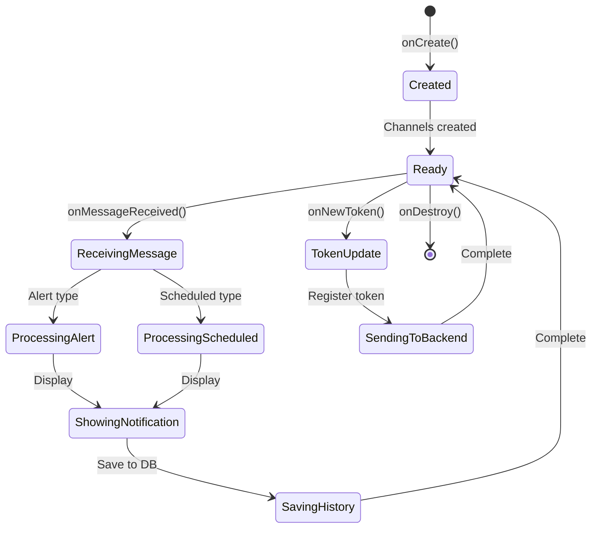
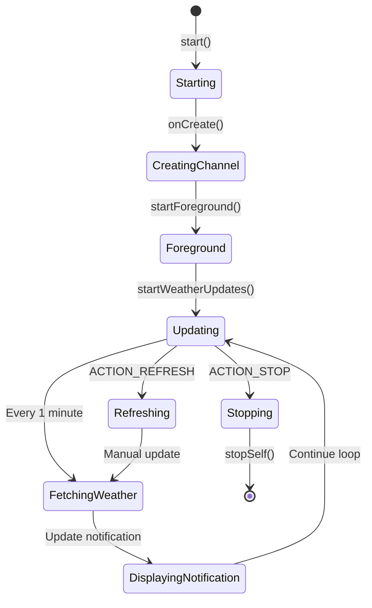
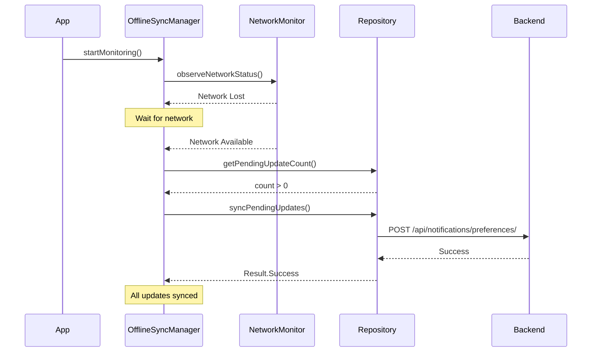
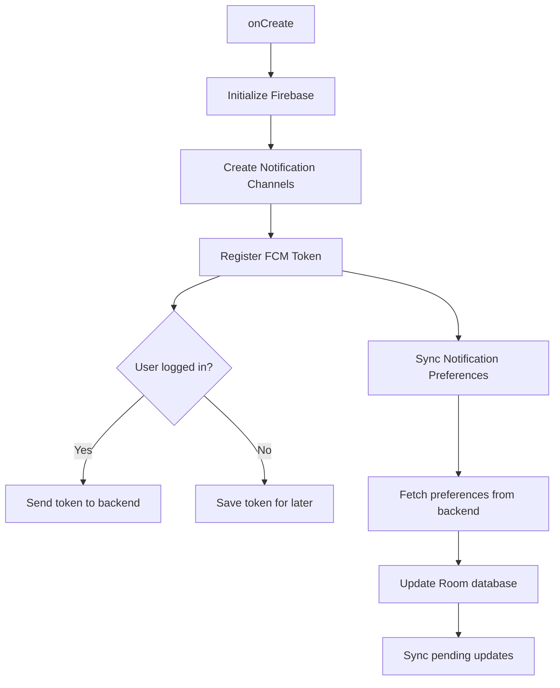

# Services Documentation - Android App

## 📋 Mục lục

- [Tổng quan](#tổng-quan)
- [1. MyFirebaseMessagingService](#1-myfirebasemessagingservice)
- [2. WeatherNotificationService](#2-weathernotificationservice)
- [3. NotificationChannelManager](#3-notificationchannelmanager)
- [4. FirebaseTokenManager](#4-firebasetokenmanager)
- [5. Background Tasks và Managers](#5-background-tasks-và-managers)
  - [5.1. NetworkMonitor](#51-networkmonitor)
  - [5.2. OfflineSyncManager](#52-offlinesyncmanager)
  - [5.3. WeatherApplication](#53-weatherapplication)
- [6. Permissions Summary](#6-permissions-summary)
- [7. Service Lifecycle Best Practices](#7-service-lifecycle-best-practices)
- [8. Testing Services](#8-testing-services)
- [9. Troubleshooting](#9-troubleshooting)
- [10. Future Enhancements](#10-future-enhancements)
- [Tài liệu liên quan](#tài-liệu-liên-quan)

## Tổng quan

Android app sử dụng nhiều services và background components để xử lý các tác vụ như nhận push notifications, cập nhật thời tiết liên tục, đồng bộ dữ liệu offline, và quản lý notification channels. Document này mô tả chi tiết về từng service, lifecycle, permissions, và background tasks.

---

## 1. MyFirebaseMessagingService

### Mô tả
Service chính để nhận và xử lý push notifications từ Firebase Cloud Messaging (FCM). Service này kế thừa từ `FirebaseMessagingService` và xử lý tất cả các loại thông báo thời tiết.

### Location
`app/src/main/java/com/example/dubaothoitiet/service/MyFirebaseMessagingService.kt`

### Chức năng chính

#### 1.1. Nhận và xử lý FCM Messages
- **Method**: `onMessageReceived(message: RemoteMessage)`
- **Mô tả**: Xử lý khi nhận được notification từ FCM
- **Flow**:
  1. Nhận message data từ FCM
  2. Xác định loại notification (`alert`, `morning_summary`, `tomorrow_forecast`, `weekly_summary`)
  3. Route đến handler tương ứng
  4. Hiển thị notification với cấu hình phù hợp
  5. Lưu vào lịch sử local database

#### 1.2. Quản lý FCM Token
- **Method**: `onNewToken(token: String)`
- **Mô tả**: Xử lý khi nhận được FCM token mới
- **Flow**:
  1. Lưu token vào SharedPreferences
  2. Gửi token lên backend qua API
  3. Backend lưu token để gửi notifications sau này

#### 1.3. Xử lý Weather Alerts
- **Method**: `handleWeatherAlert(data: Map<String, String>)`
- **Mô tả**: Xử lý thông báo cảnh báo thời tiết nguy hiểm
- **Priority**: HIGH
- **Features**:
  - Vibration pattern: `[0, 500, 250, 500]`
  - Sound: Default notification sound
  - DND Override: Có (bypass Do Not Disturb)
  - Channel: `CHANNEL_HIGH_PRIORITY`
  - Deep linking: Mở màn hình chi tiết alert khi tap

#### 1.4. Xử lý Scheduled Notifications
- **Method**: `handleScheduledNotification(data: Map<String, String>)`
- **Mô tả**: Xử lý thông báo định kỳ (tóm tắt buổi sáng, dự báo ngày mai, tóm tắt tuần)
- **Priority**: MEDIUM
- **Features**:
  - No vibration
  - Sound: Default notification sound
  - Channel: `CHANNEL_SCHEDULED`
  - Deep linking: Mở màn hình tương ứng

#### 1.5. Notification Grouping
- **Method**: `trackNotificationForGrouping()`, `showGroupSummaryIfNeeded()`
- **Mô tả**: Nhóm nhiều notifications cùng loại
- **Groups**:
  - `weather_alerts_group`: Nhóm cảnh báo
  - `weather_scheduled_group`: Nhóm thông báo định kỳ
- **Logic**: Hiển thị summary notification khi có > 1 notification trong group

#### 1.6. Lưu lịch sử Notifications
- **Method**: `saveNotificationToHistory()`
- **Mô tả**: Lưu notification vào Room database local
- **Data**: Title, body, priority, type, location, timestamp, read status
- **Hoạt động**: Ngay cả khi app không chạy (background)

### Lifecycle



### Permissions Required
- `android.permission.INTERNET`: Gửi token lên backend
- `android.permission.POST_NOTIFICATIONS`: Hiển thị notifications (Android 13+)
- `android.permission.VIBRATE`: Rung cho high-priority alerts
- `android.permission.USE_FULL_SCREEN_INTENT`: Full screen alerts (optional)

### Configuration trong AndroidManifest
```xml
<service
    android:name=".service.MyFirebaseMessagingService"
    android:exported="false">
    <intent-filter>
        <action android:name="com.google.firebase.MESSAGING_EVENT" />
    </intent-filter>
</service>
```

### Dependencies
- Firebase Cloud Messaging SDK
- Room Database (NotificationDatabase)
- Retrofit (WeatherApiService)
- NotificationChannelManager
- Coroutines (CoroutineScope)

---

## 2. WeatherNotificationService

### Mô tả
Foreground service hiển thị thông tin thời tiết liên tục trong notification tray. Service này cập nhật thông tin thời tiết định kỳ và cho phép user xem thời tiết nhanh mà không cần mở app.

### Location
`app/src/main/java/com/example/dubaothoitiet/service/WeatherNotificationService.kt`

### Chức năng chính

#### 2.1. Foreground Service
- **Type**: `dataSync` (Android 14+)
- **Notification ID**: 1001
- **Channel**: `weather_widget_channel`
- **Importance**: LOW (không làm phiền user)

#### 2.2. Cập nhật thời tiết định kỳ
- **Interval**: 1 phút
- **Method**: `updateWeatherNotification()`
- **Flow**:
  1. Lấy vị trí cuối cùng từ SharedPreferences
  2. Gọi API lấy thông tin thời tiết
  3. Tạo notification với thông tin mới
  4. Update notification trong tray

#### 2.3. Hiển thị thông tin thời tiết
- **Collapsed view**:
  - Title: `{City} - {Temperature}°C`
  - Content: `{Condition} • {Humidity}% • {Wind}km/h`
  - SubText: Dự báo thay đổi tiếp theo
- **Expanded view** (BigTextStyle):
  - Nhiệt độ hiện tại và cảm giác
  - Điều kiện thời tiết
  - Độ ẩm và tốc độ gió
  - Dự báo nhiệt độ N giờ tới (configurable)
  - Thay đổi thời tiết tiếp theo

#### 2.4. Actions
- **Refresh**: Cập nhật thời tiết ngay lập tức
- **Stop**: Dừng service và ẩn notification

#### 2.5. Smart Weather Change Detection
- **Method**: `findNextWeatherChange()`
- **Logic**: Tìm giờ đầu tiên có điều kiện thời tiết khác với hiện tại
- **Purpose**: Thông báo user về thay đổi sắp tới (mưa, nắng, etc.)

### Lifecycle



### Permissions Required
- `android.permission.INTERNET`: Gọi weather API
- `android.permission.FOREGROUND_SERVICE`: Chạy foreground service
- `android.permission.FOREGROUND_SERVICE_DATA_SYNC`: Data sync type (Android 14+)
- `android.permission.POST_NOTIFICATIONS`: Hiển thị notification (Android 13+)

### Configuration trong AndroidManifest
```xml
<service
    android:name=".service.WeatherNotificationService"
    android:enabled="true"
    android:exported="false"
    android:foregroundServiceType="dataSync" />
```

### Start/Stop Methods
```kotlin
// Start service
WeatherNotificationService.start(context)

// Stop service
WeatherNotificationService.stop(context)
```

### Customization
User có thể cấu hình số giờ dự báo hiển thị trong notification:
- SharedPreferences key: `forecast_hours`
- Default: 3 giờ
- Range: 1-6 giờ

---

## 3. NotificationChannelManager

### Mô tả
Helper class quản lý notification channels cho Android 8.0+. Tạo và cấu hình các channels với settings phù hợp cho từng loại notification.

### Location
`app/src/main/java/com/example/dubaothoitiet/service/NotificationChannelManager.kt`

### Notification Channels

#### 3.1. CHANNEL_HIGH_PRIORITY
- **ID**: `weather_alerts_high`
- **Name**: "Cảnh báo thời tiết khẩn cấp"
- **Importance**: HIGH
- **Settings**:
  - Sound: Default notification sound
  - Vibration: Enabled (`[0, 500, 250, 500]`)
  - Lights: Enabled
  - Badge: Enabled
  - Bypass DND: Enabled
- **Use case**: Cảnh báo thời tiết nguy hiểm (mưa lớn, bão, nhiệt độ cực đoan)

#### 3.2. CHANNEL_SCHEDULED
- **ID**: `weather_scheduled`
- **Name**: "Tóm tắt thời tiết định kỳ"
- **Importance**: DEFAULT
- **Settings**:
  - Sound: Default notification sound
  - Vibration: Disabled
  - Lights: Disabled
  - Badge: Enabled
  - Bypass DND: Disabled
- **Use case**: Tóm tắt buổi sáng, dự báo ngày mai, tóm tắt tuần

#### 3.3. CHANNEL_GENERAL
- **ID**: `weather_general`
- **Name**: "Thông báo chung"
- **Importance**: LOW
- **Settings**:
  - Sound: Disabled
  - Vibration: Disabled
  - Lights: Disabled
  - Badge: Enabled
  - Bypass DND: Disabled
- **Use case**: Thông báo chung, thông tin không khẩn cấp

### Channel Assignment Logic

```kotlin
fun getChannelForPriority(priority: NotificationPriority): String {
    return when (priority) {
        NotificationPriority.HIGH -> CHANNEL_HIGH_PRIORITY
        NotificationPriority.MEDIUM -> CHANNEL_SCHEDULED
        NotificationPriority.LOW -> CHANNEL_GENERAL
    }
}
```

### Methods

#### createNotificationChannels()
Tạo tất cả channels khi app khởi động (Android 8.0+)

#### areChannelsCreated()
Kiểm tra xem channels đã được tạo chưa

#### getChannelForPriority(priority)
Lấy channel ID phù hợp dựa trên priority level

#### verifyChannelAssignment(type, priority)
Verify logic gán channel đúng (dùng cho testing)

#### deleteAllChannels()
Xóa tất cả channels (dùng cho testing/reset)

---

## 4. FirebaseTokenManager

### Mô tả
Helper object quản lý việc đăng ký FCM token với backend server. Đảm bảo token được gửi lên backend để nhận notifications.

### Location
`app/src/main/java/com/example/dubaothoitiet/service/FirebaseTokenManager.kt`

### Methods

#### registerTokenWithServer(context, userId)
- **Mô tả**: Đăng ký FCM token với backend
- **Flow**:
  1. Lấy token từ SharedPreferences
  2. Tạo Retrofit instance
  3. Gửi POST request đến `/api/device-token/register/`
  4. Lưu timestamp đăng ký thành công

#### isTokenRegistered(context)
- **Mô tả**: Kiểm tra xem token đã được đăng ký chưa
- **Logic**: Token valid trong 24 giờ
- **Return**: `true` nếu đã đăng ký trong 24h qua

#### clearTokenRegistration(context)
- **Mô tả**: Xóa thông tin token (dùng khi logout)
- **Action**: Remove `fcm_token` và `fcm_token_registered_at` từ SharedPreferences

---

## 5. Background Tasks và Managers

### 5.1. NetworkMonitor

#### Mô tả
Giám sát trạng thái kết nối mạng và cung cấp reactive updates qua Flow.

#### Location
`app/src/main/java/com/example/dubaothoitiet/data/NetworkMonitor.kt`

#### Methods

##### isNetworkAvailable()
- **Return**: `Boolean`
- **Logic**: Kiểm tra active network có internet và validated không

##### observeNetworkStatus()
- **Return**: `Flow<Boolean>`
- **Mô tả**: Observe trạng thái mạng với reactive updates
- **Events**:
  - `onAvailable(network)`: Emit `true`
  - `onLost(network)`: Emit `false` nếu không còn network nào
  - `onCapabilitiesChanged()`: Emit dựa trên capabilities

#### Use Cases
- Auto-sync pending updates khi có mạng trở lại
- Hiển thị offline indicator trong UI
- Queue operations khi offline

### 5.2. OfflineSyncManager

#### Mô tả
Manager tự động sync pending updates khi có mạng trở lại. Đảm bảo các thay đổi offline được đồng bộ lên backend.

#### Location
`app/src/main/java/com/example/dubaothoitiet/data/OfflineSyncManager.kt`

#### Methods

##### startMonitoring()
- **Mô tả**: Bắt đầu monitor network và auto-sync
- **Flow**:
  1. Observe network status từ NetworkMonitor
  2. Khi có mạng, kiểm tra pending updates
  3. Sync tất cả pending updates lên backend
  4. Log kết quả

##### stopMonitoring()
- **Mô tả**: Dừng monitoring (gọi khi app destroy)

##### manualSync()
- **Return**: `Result<Unit>`
- **Mô tả**: Trigger manual sync từ UI

##### getPendingCount()
- **Return**: `Int`
- **Mô tả**: Lấy số lượng updates đang chờ sync

#### Sync Logic


### 5.3. WeatherApplication

#### Mô tả
Application class khởi tạo các services và components khi app start.

#### Location
`app/src/main/java/com/example/dubaothoitiet/WeatherApplication.kt`

#### Initialization Flow



#### Methods

##### initializeFirebase()
- Khởi tạo Firebase Cloud Messaging
- Log success/error

##### createNotificationChannels()
- Tạo channels nếu chưa có (Android 8.0+)
- Skip nếu đã tồn tại

##### registerFCMToken()
- Lấy FCM token bất đồng bộ
- Lưu vào SharedPreferences
- Gửi lên backend nếu user đã login

##### syncNotificationPreferences()
- Sync preferences từ backend khi app start
- Xử lý errors gracefully (không block startup)
- Sync pending updates nếu có

---

## 6. Permissions Summary

### Required Permissions

| Permission | Purpose | Required API Level |
|-----------|---------|-------------------|
| `INTERNET` | Gọi API, gửi token lên backend | All |
| `ACCESS_FINE_LOCATION` | Lấy vị trí chính xác cho weather | All |
| `ACCESS_COARSE_LOCATION` | Lấy vị trí gần đúng | All |
| `POST_NOTIFICATIONS` | Hiển thị notifications | 33+ (Android 13) |
| `FOREGROUND_SERVICE` | Chạy foreground service | All |
| `FOREGROUND_SERVICE_DATA_SYNC` | Data sync foreground service | 34+ (Android 14) |
| `USE_FULL_SCREEN_INTENT` | Full screen alerts (optional) | All |
| `VIBRATE` | Rung cho high-priority alerts | All |

### Runtime Permissions
Các permissions sau cần request runtime:
- `POST_NOTIFICATIONS` (Android 13+)
- `ACCESS_FINE_LOCATION`
- `ACCESS_COARSE_LOCATION`

### Permission Handling
- Request trong `NotificationPermissionHandler.kt`
- Check và request khi cần thiết
- Graceful degradation nếu user từ chối

---

## 7. Service Lifecycle Best Practices

### 7.1. MyFirebaseMessagingService
- **Lifecycle**: Managed by system
- **Start**: Tự động khi có FCM message
- **Stop**: Tự động sau khi xử lý xong
- **Cleanup**: `onDestroy()` - clear notification groups

### 7.2. WeatherNotificationService
- **Lifecycle**: Managed by app
- **Start**: User action hoặc app preference
- **Stop**: User action (tap "Tắt" button)
- **Cleanup**: Cancel coroutine jobs

### 7.3. Background Work Guidelines
- Sử dụng Coroutines với `SupervisorJob` để tránh crash
- Timeout cho network calls
- Graceful error handling
- Log tất cả operations cho debugging

---

## 8. Testing Services

### Unit Tests
- Test notification channel assignment logic
- Test notification grouping logic
- Test token registration flow
- Test offline sync logic

### Integration Tests
- Test FCM message handling end-to-end
- Test foreground service lifecycle
- Test network monitoring và auto-sync
- Test notification display với different priorities

### Manual Testing Checklist
- [ ] Nhận được FCM notifications khi app foreground
- [ ] Nhận được FCM notifications khi app background
- [ ] Nhận được FCM notifications khi app killed
- [ ] Notifications hiển thị đúng channel và priority
- [ ] Deep linking hoạt động khi tap notification
- [ ] Notification grouping hoạt động với nhiều notifications
- [ ] Foreground service hiển thị và cập nhật thời tiết
- [ ] Auto-sync hoạt động khi có mạng trở lại
- [ ] Token được gửi lên backend sau login
- [ ] Preferences được sync từ backend khi app start

---

## 9. Troubleshooting

### FCM Notifications không nhận được
1. Kiểm tra Firebase configuration (`google-services.json`)
2. Verify FCM token đã được gửi lên backend
3. Check backend logs xem có gửi notification không
4. Verify notification permissions đã được grant
5. Check notification channels chưa bị user disable

### Foreground Service không start
1. Verify permissions trong AndroidManifest
2. Check Android version (foregroundServiceType cần Android 14+)
3. Verify notification channel đã được tạo
4. Check logs cho errors

### Auto-sync không hoạt động
1. Verify NetworkMonitor đang observe network
2. Check có pending updates không
3. Verify network connectivity
4. Check backend API availability

### Notifications không có sound/vibration
1. Check notification channel settings
2. Verify user chưa disable sound/vibration trong system settings
3. Check Do Not Disturb mode
4. Verify channel importance level

---

## 10. Future Enhancements

### Planned Features
- [ ] WorkManager cho scheduled background tasks
- [ ] Notification actions (Reply, Dismiss, Snooze)
- [ ] Custom notification sounds
- [ ] Notification categories (Weather, Alerts, Updates)
- [ ] Battery optimization handling
- [ ] Notification analytics

### Performance Optimizations
- [ ] Batch notification updates
- [ ] Reduce network calls frequency
- [ ] Optimize database queries
- [ ] Cache weather data locally

---

## Tài liệu liên quan
- [System Design](./SYSTEM_DESIGN.md) - Kiến trúc tổng thể
- [UI Documentation](./UI_DOCUMENTATION.md) - Notification UI components
- [Navigation](./NAVIGATION.md) - Deep linking từ notifications
- [Data Layer](./DATA_LAYER.md) - NotificationRepository và database


---

**Last Updated**: 2025-01-24  
**Firebase SDK**: 32.7.0  
**Maintained By**: Android Development Team
