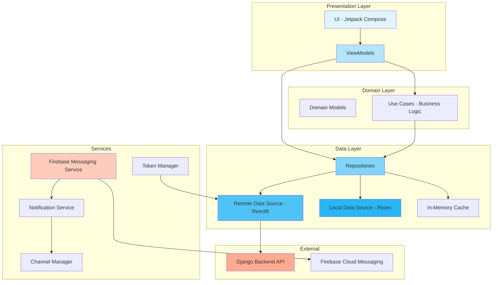
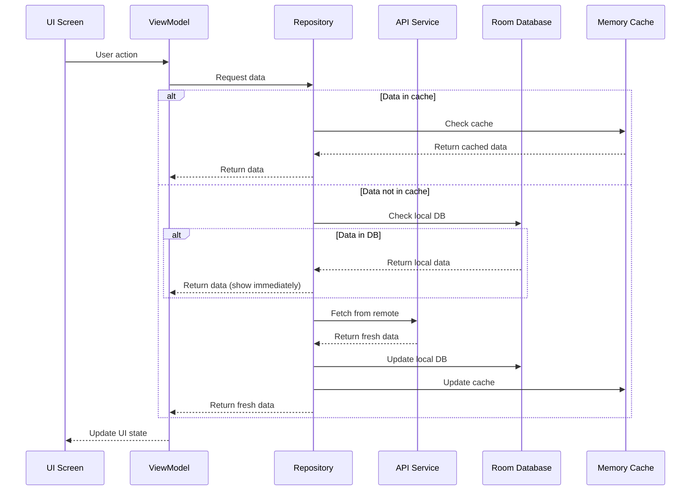
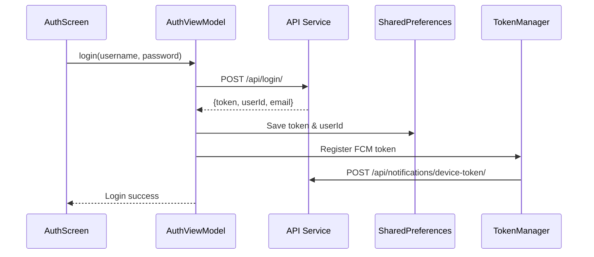
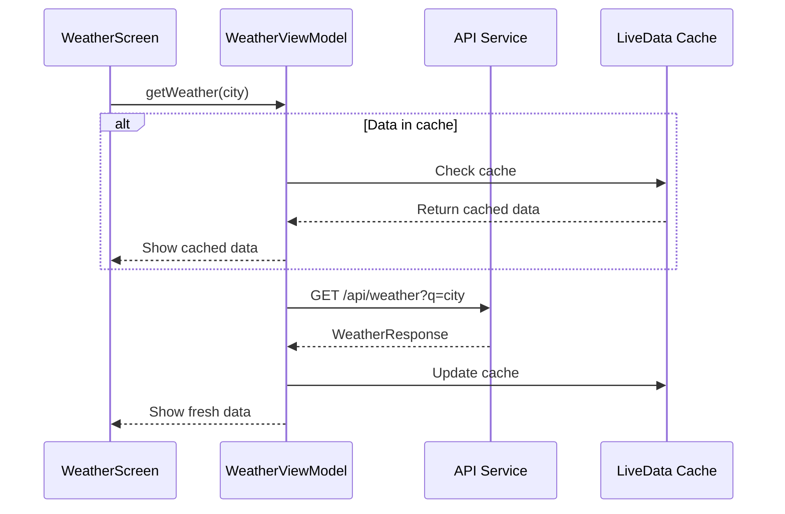
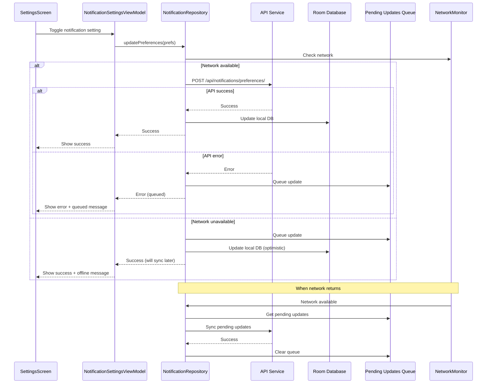
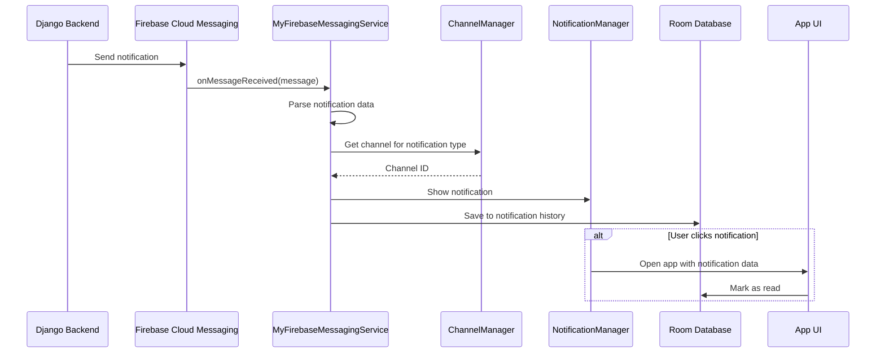

# System Design - Android Weather App

## Tổng quan

Ứng dụng Android Weather App được xây dựng theo kiến trúc **MVVM (Model-View-ViewModel)** kết hợp với **Clean Architecture principles**. Ứng dụng sử dụng Jetpack Compose cho UI, Kotlin Coroutines cho async operations, và Room Database cho local storage.

### Mục đích

Ứng dụng cung cấp thông tin dự báo thời tiết chi tiết, cảnh báo thiên tai, và tư vấn AI về thời tiết. Người dùng có thể theo dõi nhiều địa điểm, nhận thông báo push về thời tiết nguy hiểm, và quản lý preferences thông báo.

### Đặc điểm chính

- **Offline-first**: Dữ liệu được cache local, sync với server khi có mạng
- **Real-time notifications**: Nhận thông báo push qua Firebase Cloud Messaging
- **Reactive UI**: Sử dụng Flow và LiveData để update UI tự động
- **Modular architecture**: Tách biệt rõ ràng giữa các layers

---

## Kiến trúc tổng thể

### Architecture Diagram



### Data Flow



---

## Các Layers chi tiết

### 1. Presentation Layer (UI + ViewModel)

#### UI Components (Jetpack Compose)

**Screens chính:**
- `MainActivity`: Entry point, quản lý navigation và auth state
- `AuthScreen`: Đăng nhập / Đăng ký
- `WeatherScreen`: Màn hình chính hiển thị thời tiết
- `TrackedLocationsScreen`: Danh sách địa điểm đã theo dõi
- `NotificationSettingsScreen`: Cài đặt thông báo chung
- `LocationNotificationSettingsScreen`: Cài đặt thông báo cho từng địa điểm
- `NotificationHistoryScreen`: Lịch sử thông báo
- `WeatherChartsScreen`: Biểu đồ thời tiết (Rain, UV, AQI)

**Reusable Components:**
- `CurrentWeather`: Hiển thị thời tiết hiện tại
- `DailyForecast`: Dự báo theo ngày
- `HourlyForecast`: Dự báo theo giờ
- `WeatherAlertsSection`: Hiển thị cảnh báo
- `CombinedAdviceSection`: Hiển thị tư vấn AI
- `NotificationPermissionHandler`: Xử lý quyền thông báo

#### ViewModels

**Chức năng:** Quản lý UI state, xử lý business logic, giao tiếp với Repository

**ViewModels chính:**

1. **AuthViewModel**
   - Quản lý authentication state
   - Xử lý login/register/logout
   - Lưu token vào SharedPreferences

2. **WeatherViewModel**
   - Fetch dữ liệu thời tiết từ API
   - Cache kết quả trong LiveData
   - Xử lý errors và loading states

3. **UserViewModel**
   - Quản lý thông tin user hiện tại
   - Sync user data với backend
   - Handle logout cleanup

4. **LocationViewModel**
   - Track/untrack locations
   - Quản lý danh sách tracked locations

5. **TrackedLocationsViewModel**
   - Load danh sách locations đã track
   - Quản lý location preferences
   - Toggle notifications cho từng location

6. **NotificationSettingsViewModel**
   - Quản lý notification preferences chung
   - Sync preferences với backend
   - Handle offline updates với queue

7. **NotificationHistoryViewModel**
   - Load lịch sử thông báo
   - Filter theo type và time range
   - Mark notifications as read

8. **AlertViewModel & AdviceViewModel**
   - Fetch alerts và advice từ backend
   - Cache và display trong UI

9. **CombinedAdviceViewModel**
   - Kết hợp alerts và advice
   - Quản lý state cho advice generation

**Pattern:** ViewModels sử dụng `LiveData` và `StateFlow` để expose data cho UI. UI observe các streams này và tự động update khi data thay đổi.

### 2. Domain Layer

#### Domain Models

**Data classes đại diện cho business entities:**

- `User`: Thông tin user (userId, email, token)
- `WeatherResponse`: Dữ liệu thời tiết đầy đủ
- `TrackedLocation`: Địa điểm đã theo dõi
- `ExtremeAlert`: Cảnh báo thiên tai
- `AdviceResponse`: Tư vấn AI về thời tiết
- `NotificationPreferences`: Preferences thông báo chung
- `LocationNotificationPreferences`: Preferences cho từng location
- `NotificationRecord`: Lịch sử thông báo

**Enums:**
- `NotificationType`: Loại thông báo (ALERT, MORNING_SUMMARY, etc.)
- `EventType`: Loại sự kiện thời tiết (RAIN, STORM, HEAT, etc.)
- `NotificationSchedule`: Lịch thông báo (IMMEDIATE, MORNING, EVENING, etc.)

#### Business Logic

Business logic được đặt trong:
- **ViewModels**: Logic liên quan đến UI state
- **Repositories**: Logic liên quan đến data operations
- **Mappers**: Convert giữa DTOs và Domain models

### 3. Data Layer

#### Repositories

**Chức năng:** Trung gian giữa ViewModels và Data Sources, quản lý caching và sync logic

**NotificationRepository:**
- Quản lý notification preferences (chung và per-location)
- Quản lý notification history
- Xử lý offline sync với queue
- Implement retry logic với exponential backoff
- Last-write-wins conflict resolution

**Pattern:**
```kotlin
suspend fun updatePreferences(preferences: NotificationPreferences): Result<Unit> {
    // 1. Check network
    if (!networkMonitor.isNetworkAvailable()) {
        queuePreferenceUpdate(preferences)
        return Result.Error("No network")
    }
    
    // 2. Sync to remote FIRST
    val syncResult = syncPreferencesToRemote(preferences)
    
    // 3. Update local ONLY if remote succeeds
    if (syncResult is Result.Success) {
        database.insertPreferences(preferences)
    }
    
    return syncResult
}
```

#### Remote Data Source (API)

**WeatherApiService (Retrofit):**

Endpoints chính:
- `GET /api/weather`: Lấy dữ liệu thời tiết
- `POST /api/register/`: Đăng ký user
- `POST /api/login/`: Đăng nhập
- `POST /api/locations/track/`: Track location
- `GET /api/locations/tracked/`: Lấy tracked locations
- `POST /api/locations/delete/`: Xóa tracked location
- `GET /api/alerts/`: Lấy cảnh báo thiên tai
- `GET /api/advice/`: Lấy tư vấn AI
- `GET /api/check-advice/`: Kiểm tra advice có sẵn
- `GET /api/notifications/preferences/`: Lấy preferences
- `POST /api/notifications/preferences/`: Cập nhật preferences
- `GET /api/notifications/preferences/location/{id}/`: Lấy location preferences
- `POST /api/notifications/preferences/location/{id}/`: Cập nhật location preferences
- `GET /api/notifications/history/`: Lấy lịch sử thông báo
- `POST /api/notifications/device-token/`: Đăng ký FCM token

**Configuration:**
- Base URL: `http://127.0.0.1:8000/`
- Timeout: 30s connect, 300s read/write
- Logging: Full body logging trong debug mode

#### Local Data Source (Room Database)

**NotificationDatabase:**

**Tables:**
1. `notification_preferences`: Preferences thông báo chung
   - userId, notificationsEnabled, enabledEventTypes, schedule, etc.

2. `location_notification_preferences`: Preferences cho từng location
   - userId, locationId, notificationsEnabled, lastSyncedAt

3. `notification_records`: Lịch sử thông báo
   - id, userId, notificationType, title, body, timestamp, isRead, etc.

**DAOs:**
- `NotificationPreferencesDao`: CRUD operations cho preferences
- `LocationNotificationPreferencesDao`: CRUD operations cho location preferences
- `NotificationRecordDao`: CRUD operations cho notification history

**Features:**
- Reactive queries với Flow
- Automatic migrations
- Type converters cho complex types (List, Enum)

#### In-Memory Cache

ViewModels cache data trong `LiveData` và `StateFlow` để tránh fetch lại khi không cần thiết.

### 4. Services Layer

#### Firebase Messaging Service

**MyFirebaseMessagingService:**
- Nhận push notifications từ FCM
- Parse notification payload
- Hiển thị notification với đúng channel
- Lưu vào notification history
- Handle notification clicks

**Notification Types:**
- `alert`: Cảnh báo thời tiết nguy hiểm (High priority)
- `morning_summary`: Tóm tắt buổi sáng (Default priority)
- `tomorrow_forecast`: Dự báo ngày mai (Default priority)
- `weekly_summary`: Tóm tắt tuần (Low priority)

#### Notification Channel Manager

**NotificationChannelManager:**
- Tạo notification channels (Android 8.0+)
- Quản lý channel properties (importance, sound, vibration)
- Map notification types to channels

**Channels:**
- `weather_alerts`: Cảnh báo khẩn cấp (High importance)
- `weather_summaries`: Tóm tắt thời tiết (Default importance)
- `weather_forecasts`: Dự báo (Default importance)

#### Firebase Token Manager

**FirebaseTokenManager:**
- Lấy FCM token từ Firebase
- Đăng ký token với backend
- Refresh token khi cần
- Handle token registration errors

#### Weather Notification Service

**WeatherNotificationService:**
- Foreground service cho weather monitoring
- Periodic weather checks
- Trigger notifications khi có alerts

### 5. Application Class

**WeatherApplication:**

**Khởi tạo khi app start:**
1. Initialize Firebase
2. Create notification channels
3. Register FCM token với backend
4. Sync notification preferences từ backend
5. Sync pending updates (nếu có)

**Lifecycle:**
- `onCreate()`: Chạy một lần khi app khởi động
- Application-level coroutine scope cho background tasks

---

## Components chính

### 1. Authentication Flow



### 2. Weather Data Flow



### 3. Notification Preferences Sync



### 4. Push Notification Flow



---

## Công nghệ sử dụng

### Core Technologies

| Công nghệ | Version | Mục đích |
|-----------|---------|----------|
| Kotlin | 2.0.21 | Ngôn ngữ chính |
| Android SDK | Min 24, Target 36 | Platform |
| Jetpack Compose | BOM latest | UI framework |
| Kotlin Coroutines | - | Async operations |

### Jetpack Components

| Component | Version | Mục đích |
|-----------|---------|----------|
| Lifecycle | 2.8.3 | ViewModel, LiveData |
| Navigation Compose | 2.8.0-beta05 | Navigation |
| Room | 2.6.1 | Local database |
| Activity Compose | - | Activity integration |

### Networking & Data

| Library | Version | Mục đích |
|---------|---------|----------|
| Retrofit | 2.9.0 | HTTP client |
| Gson | 2.9.0 | JSON parsing |
| OkHttp Logging | 4.12.0 | Network logging |
| Coil | 2.6.0 | Image loading |

### Firebase

| Service | Version | Mục đích |
|---------|---------|----------|
| Firebase BOM | 32.7.0 | Firebase platform |
| Firebase Messaging | - | Push notifications |

### Other Libraries

| Library | Version | Mục đích |
|---------|---------|----------|
| Material Icons Extended | - | Icons |
| Play Services Location | 21.0.1 | GPS location |

### Build Tools

| Tool | Version |
|------|---------|
| Gradle | 8.x |
| KSP | 2.0.21-1.0.25 |
| Java | 11 |

---

## Offline Support Strategy

### Caching Strategy

**3-tier caching:**
1. **Memory Cache**: LiveData/StateFlow trong ViewModels (fastest)
2. **Disk Cache**: Room Database (persistent)
3. **Remote**: Backend API (source of truth)

### Sync Strategy

**Offline-first approach:**
- Luôn hiển thị data từ local trước
- Fetch từ remote trong background
- Update UI khi có fresh data

**Conflict Resolution:**
- Last-write-wins: Timestamp cao hơn thắng
- Pending updates queue: Retry khi có mạng

### Queue Management

**PendingPreferenceUpdate:**
```kotlin
sealed class PendingPreferenceUpdate {
    data class NotificationPreferencesUpdate(
        val userId: Int,
        val preferences: NotificationPreferences
    )
    
    data class LocationPreferencesUpdate(
        val userId: Int,
        val locationId: Int,
        val notificationsEnabled: Boolean
    )
}
```

**Auto-sync:**
- NetworkMonitor observe network state
- Tự động sync queue khi có mạng trở lại
- Exponential backoff cho retry

---

## Error Handling

### Error Types

1. **Network Errors**: IOException, timeout
2. **API Errors**: HTTP 4xx, 5xx
3. **Database Errors**: SQLiteException
4. **Parse Errors**: JsonSyntaxException

### Error Handling Strategy

**Result wrapper:**
```kotlin
sealed class Result<out T> {
    data class Success<T>(val data: T) : Result<T>()
    data class Error(
        val exception: Exception? = null,
        val message: String? = null
    ) : Result<Nothing>()
    object Loading : Result<Nothing>()
}
```

**Retry logic:**
- Max 3 attempts
- Exponential backoff: 1s, 2s, 4s
- Graceful degradation: Show cached data

**User feedback:**
- Loading states
- Error messages
- Offline indicators
- Success confirmations

---

## Security Considerations

### Authentication

- Token-based auth (JWT)
- Token stored in SharedPreferences (encrypted on Android 6.0+)
- Token sent in Authorization header

### Data Protection

- HTTPS for all API calls
- Room database encrypted (optional)
- Sensitive data not logged in production

### Permissions

**Required permissions:**
- `ACCESS_FINE_LOCATION`: Lấy vị trí hiện tại
- `POST_NOTIFICATIONS`: Hiển thị notifications (Android 13+)
- `INTERNET`: Network access
- `ACCESS_NETWORK_STATE`: Check network status

**Runtime permissions:**
- Location: Requested khi user click "Vị trí hiện tại"
- Notifications: Requested khi app khởi động (Android 13+)

---

## Performance Optimizations

### UI Performance

- Lazy loading cho lists
- Pagination cho notification history
- Image caching với Coil
- Compose recomposition optimization

### Network Performance

- Request caching
- Batch requests khi có thể
- Timeout configuration
- Connection pooling (OkHttp)

### Database Performance

- Indexes trên frequently queried columns
- Batch inserts
- Background thread operations
- Query optimization

### Memory Management

- Clear caches khi memory low
- Lifecycle-aware components
- Proper coroutine cancellation
- Avoid memory leaks

---

## Testing Strategy

### Unit Tests

**Test targets:**
- ViewModels logic
- Repository operations
- Data mappers
- Utility functions

**Test files:**
- `NotificationChannelAssignmentTest`: Test channel assignment logic
- `NotificationHistoryStorageTest`: Test notification storage

### Integration Tests

**Test scenarios:**
- API integration
- Database operations
- Offline sync flow
- Notification handling

### UI Tests

**Test với Compose:**
- Screen navigation
- User interactions
- State updates
- Error states

---

## Future Enhancements

### Planned Features

1. **Widget support**: Home screen widget hiển thị thời tiết
2. **Dark mode**: Theme switching
3. **Multi-language**: i18n support
4. **Weather maps**: Hiển thị bản đồ thời tiết
5. **Historical data**: Xem lịch sử thời tiết

### Technical Improvements

1. **Dependency Injection**: Migrate to Hilt/Koin
2. **Modularization**: Chia app thành modules
3. **Compose Navigation**: Migrate to type-safe navigation
4. **Testing**: Increase test coverage
5. **CI/CD**: Automated testing và deployment

---

## Tài liệu liên quan

- [UI Documentation](UI_DOCUMENTATION.md)
- [Navigation](NAVIGATION.md)
- [Services](SERVICES.md)
- [Data Layer](DATA_LAYER.md)
- [Project Structure](PROJECT_STRUCTURE.md)
- [Testing](TESTING.md)

---

**Validates Requirements:** 3.1, 3.2, 3.3, 3.4, 3.5


---

**Last Updated**: 2025-01-24  
**Architecture**: MVVM + Clean Architecture  
**Maintained By**: Android Development Team
