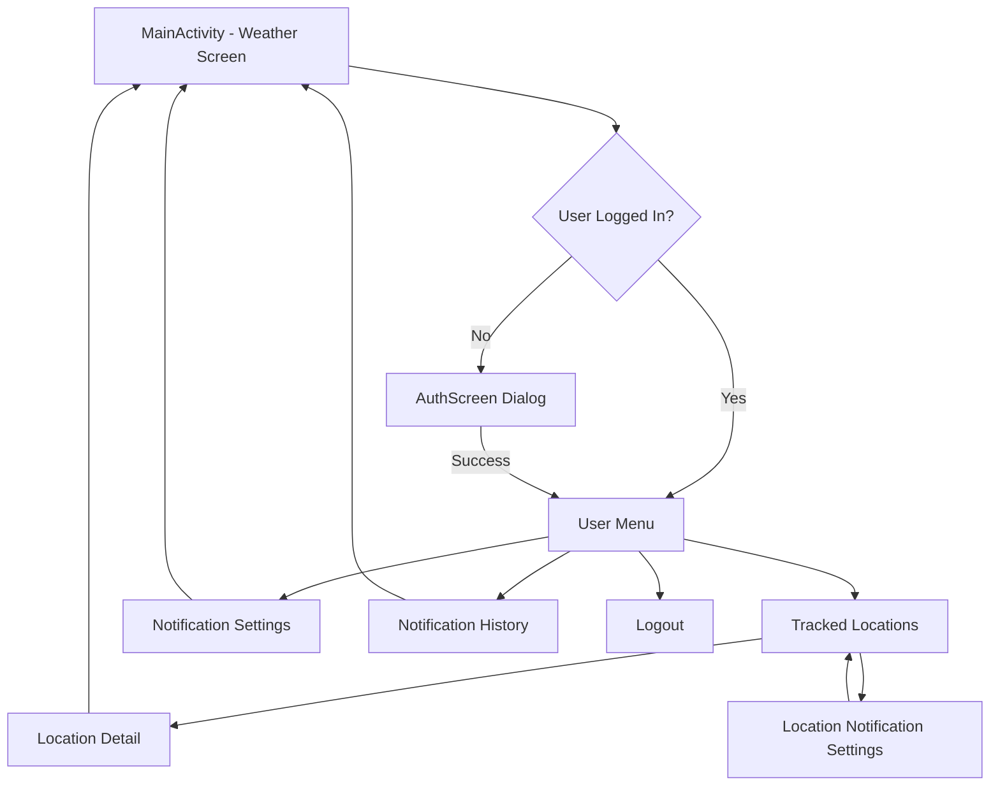

# UI Documentation - Android App

## 📋 Mục lục

- [Tổng quan](#tổng-quan)
- [Danh sách Screens](#danh-sách-screens)
  - [1. MainActivity (Main Weather Screen)](#1-mainactivity-main-weather-screen)
  - [2. AuthScreen](#2-authscreen)
  - [3. TrackedLocationsScreen](#3-trackedlocationsscreen)
  - [4. NotificationSettingsScreen](#4-notificationsettingsscreen)
  - [5. NotificationHistoryScreen](#5-notificationhistoryscreen)
  - [6. LocationNotificationSettingsScreen](#6-locationnotificationsettingsscreen)
  - [7. WeatherChartsScreen](#7-weatherchartsscreen)
- [Reusable UI Components](#reusable-ui-components)
- [Navigation Flow](#navigation-flow)
- [Theme và Styling](#theme-và-styling)
- [State Management](#state-management)
- [Loading States](#loading-states)
- [Accessibility](#accessibility)
- [Performance Optimizations](#performance-optimizations)
- [Testing Considerations](#testing-considerations)
- [Responsive Design](#responsive-design)
- [Animation và Transitions](#animation-và-transitions)
- [Lưu ý Đặc biệt](#lưu-ý-đặc-biệt)
- [Future Enhancements](#future-enhancements)
- [Tài liệu Tham khảo](#tài-liệu-tham-khảo)

## Tổng quan

Ứng dụng Android Dự báo Thời tiết được xây dựng bằng **Jetpack Compose**, framework UI hiện đại của Android. Ứng dụng tuân theo Material Design 3 và sử dụng kiến trúc MVVM (Model-View-ViewModel) để tách biệt logic và UI.

## Danh sách Screens

### 1. MainActivity (Main Weather Screen)
**File**: `MainActivity.kt`  
**Mô tả**: Màn hình chính hiển thị thông tin thời tiết chi tiết

#### Cấu trúc
```
MainActivity
├── WeatherApp (Root Composable)
│   ├── TopAppBar
│   │   ├── Location Button
│   │   └── User Menu / Login Button
│   └── WeatherScreen
│       ├── City Search Input
│       ├── Current Weather Display
│       ├── Weather Charts (Rain, UV, AQI)
│       ├── Combined Advice Section (AI)
│       ├── Weather Alerts Section
│       ├── Track Location Button
│       ├── Daily Forecast (3 days)
│       ├── Hourly Forecast (24 hours)
│       └── Additional Weather Info
```

#### Các Components chính

**CurrentWeather**
- Hiển thị: Tên thành phố, quốc gia, nhiệt độ hiện tại, điều kiện thời tiết, icon, thời gian cập nhật
- Layout: Column với Text và Image components

**DailyForecast**
- Hiển thị: Dự báo 3 ngày với ngày tháng, icon, nhiệt độ max/min, tỷ lệ mưa
- Layout: Horizontal scrollable Row với Cards
- Tương tác: Click để chọn ngày, card được highlight khi selected

**HourlyForecast**
- Hiển thị: Dự báo 24 giờ với thời gian, icon, nhiệt độ, tỷ lệ mưa
- Layout: Horizontal scrollable Row với Cards
- Tương tác: Click để xem chi tiết giờ đó

**HourlyDetailInfo**
- Hiển thị: Chi tiết thời tiết của giờ được chọn (cảm giác như, độ ẩm, gió, UV)
- Layout: Card với Grid layout (2x2)

**AdditionalWeatherInfo**
- Hiển thị: Thông tin bổ sung (cảm giác như, độ ẩm, gió, tầm nhìn)
- Layout: Card với Grid layout (2x2)

**CombinedAdviceSection**
- Hiển thị: Lời khuyên/cảnh báo từ AI dựa trên thời tiết
- States: Idle, Loading, Stale (có nút generate), Success (hiển thị advice), Error
- Layout: Card với icon, title, message, nút "Ẩn"
- Màu sắc: Vàng nhạt cho warning, xanh nhạt cho advice

**WeatherAlertsSection**
- Hiển thị: Cảnh báo thiên tai chính thức từ API
- Layout: Column với multiple AlertCards
- Tương tác: Click để expand/collapse chi tiết

---

### 2. AuthScreen
**File**: `AuthScreen.kt`  
**Mô tả**: Màn hình đăng nhập/đăng ký

#### Cấu trúc
```
AuthScreen (Dialog)
├── Card Container
│   ├── Lock Icon
│   ├── Title (Đăng Nhập / Đăng Ký)
│   ├── LoginContent / RegisterContent
│   │   ├── Username TextField
│   │   ├── Password TextField
│   │   ├── [Confirm Password TextField - Register only]
│   │   └── Submit Button
│   ├── Loading Indicator / Error Message
│   └── AuthToggle (Switch between Login/Register)
```

#### Tính năng
- Toggle giữa Login và Register mode
- Validation: Disable button khi fields trống
- Loading state với CircularProgressIndicator
- Error messages hiển thị bằng Text màu đỏ
- Auto-close dialog khi authentication thành công

---

### 3. TrackedLocationsScreen
**File**: `TrackedLocationsScreen.kt`  
**Mô tả**: Màn hình quản lý các vị trí đã theo dõi

#### Cấu trúc
```
TrackedLocationsScreen
├── TopAppBar
│   └── Back Button
└── LazyColumn (List of TrackedLocationCard)
    └── TrackedLocationCard
        ├── Weather Icon
        ├── Location Info
        │   ├── Location Name
        │   ├── Condition Text
        │   └── Temperature
        ├── Additional Info (Rain %, Wind)
        ├── Divider
        └── Controls Row
            ├── Notification Toggle (Icon + Label + Switch)
            └── Delete Button
```

#### Tính năng
- Hiển thị danh sách locations với thông tin thời tiết real-time
- Click vào card để xem chi tiết thời tiết của location đó
- Toggle notification on/off cho từng location
- Xóa location với confirmation dialog
- Empty state khi chưa có location nào
- Loading state với CircularProgressIndicator

**DeleteLocationDialog**
- Confirmation dialog trước khi xóa
- Hiển thị tên location và warning message
- Buttons: "Xóa" (màu đỏ) và "Hủy"

---

### 4. NotificationSettingsScreen
**File**: `ui/NotificationSettingsScreen.kt`  
**Mô tả**: Màn hình cài đặt thông báo toàn cục

#### Cấu trúc
```
NotificationSettingsScreen
├── TopAppBar
│   ├── Back Button
│   └── Sync Button
└── LazyColumn
    ├── Master Notification Toggle Card
    ├── Weather Widget Toggle Card
    ├── Widget Forecast Hours Setting
    ├── Event Types Section
    │   └── EventCategoryCard (expandable)
    │       └── EventTypeToggleItem (multiple)
    ├── Notification Schedule Section
    │   └── ScheduleOptionItem (radio buttons)
    ├── Scheduled Notifications Section
    │   ├── Morning Summary Toggle
    │   ├── Tomorrow Forecast Toggle
    │   └── Weekly Summary Toggle
    └── Info Card
```

#### Các Section chi tiết

**Master Toggle**
- Bật/tắt tất cả thông báo
- Card màu primary khi enabled, surfaceVariant khi disabled

**Weather Widget Toggle**
- Bật/tắt widget thời tiết trên thanh thông báo
- Tự động start/stop WeatherNotificationService

**Event Types Section**
- Nhóm theo category: Lũ lụt & Mưa, Bão & Gió, Nhiệt độ, Sức khỏe, Cảnh báo chính thức
- Mỗi category có thể expand/collapse
- Toggle riêng cho từng loại sự kiện (Heavy Rain, Flood, Storm, etc.)

**Notification Schedule**
- Radio buttons: Always, Daytime Only, Manual
- Ghi chú: Cảnh báo ưu tiên cao luôn gửi ngay lập tức

**Scheduled Notifications**
- Morning Summary (7:00 AM)
- Tomorrow Forecast (8:00 PM)
- Weekly Summary (Sunday 8:00 PM)

#### Tính năng đặc biệt
- **Permission Warning**: Hiển thị warning card khi không có notification permission, với nút mở Settings
- **Sync Status**: Icon sync với animation khi đang đồng bộ
- **Offline Support**: Lưu changes locally, sync khi có mạng
- **Validation**: Hiển thị validation errors qua Snackbar

---

### 5. NotificationHistoryScreen
**File**: `ui/NotificationHistoryScreen.kt`  
**Mô tả**: Màn hình lịch sử thông báo đã nhận

#### Cấu trúc
```
NotificationHistoryScreen
├── TopAppBar
│   ├── Back Button
│   ├── Title + Unread Count
│   ├── Filter Button (with badge)
│   └── Refresh Button
└── LazyColumn
    └── NotificationListItem
        ├── Icon (colored by type)
        ├── Content
        │   ├── Title
        │   ├── Body Preview (2 lines)
        │   └── Metadata (timestamp, priority badge)
        └── Unread Indicator (dot)
```

#### Tính năng

**Filtering**
- Filter by notification type (Alert, Morning Summary, Tomorrow Forecast, Weekly Summary)
- Filter by date range (Today, Last 7 days, Last 30 days, All time)
- Badge hiển thị khi có filter active

**Notification List**
- Hiển thị icon màu sắc theo loại thông báo
- Bold text cho thông báo chưa đọc
- Priority badge cho thông báo ưu tiên cao
- Relative timestamp (vừa xong, 5 phút trước, 2 giờ trước, etc.)

**Detail Dialog**
- Click vào notification để xem chi tiết đầy đủ
- Hiển thị: Icon, Title, Full Body, Type, Priority, Timestamp, Location
- Tự động mark as read khi mở

**Empty State**
- Hiển thị icon và message khi không có thông báo
- Nút "Xóa bộ lọc" khi empty do filtering

---

### 6. LocationNotificationSettingsScreen
**File**: `ui/LocationNotificationSettingsScreen.kt`  
**Mô tả**: Màn hình cài đặt thông báo cho một location cụ thể

#### Cấu trúc
```
LocationNotificationSettingsScreen
├── TopAppBar
│   ├── Back Button
│   └── Title + Location Name
└── Column
    ├── Location Info Card
    │   ├── Location Name with icon
    │   └── Description
    ├── Notification Toggle Card
    │   ├── Title & Description
    │   └── Switch / Loading Indicator
    └── Info Card
        └── Notes about notification settings
```

#### Tính năng
- Simple toggle để bật/tắt thông báo cho location
- Loading state khi đang update
- Info card giải thích về cài đặt
- Liên kết với global notification settings

---

### 7. WeatherChartsScreen
**File**: `ui/WeatherChartsScreen.kt`  
**Mô tả**: Component hiển thị biểu đồ thời tiết (Rain, UV, AQI)

#### Cấu trúc
```
WeatherChartsScreen (Card)
├── Tab Selector (3 buttons)
│   ├── Rain Tab
│   ├── UV Tab
│   └── AQI Tab
└── Chart Content
    ├── Chart Title
    ├── Canvas (Bar Chart)
    └── Legend
```

#### Các Charts

**RainChart**
- Biểu đồ cột hiển thị lượng mưa 24 giờ tới
- Màu sắc theo tỷ lệ mưa: Xanh đậm (≥70%), Xanh vừa (40-69%), Xanh nhạt (<40%)
- Hiển thị % mưa trên mỗi cột
- Trục X: Thời gian (mỗi 3 giờ)

**UVChart**
- Biểu đồ cột hiển thị chỉ số UV 24 giờ tới
- Màu sắc theo mức độ:
  - Xanh lá (0-2): Thấp
  - Cam (3-5): Trung bình
  - Đỏ cam (6-7): Cao
  - Hồng (8-10): Rất cao
  - Tím (11+): Cực cao
- Hiển thị số UV trên mỗi cột (nếu ≥3)

**AQIChart**
- Biểu đồ cột hiển thị chất lượng không khí 24 giờ tới
- Màu sắc theo AQI standard:
  - Xanh lá (0-50): Tốt
  - Vàng (51-100): Trung bình
  - Cam (101-150): Không tốt cho nhóm nhạy cảm
  - Đỏ (151-200): Xấu
  - Tím (201-300): Rất xấu
  - Nâu đỏ (301+): Nguy hại
- Hiển thị số AQI trên mỗi cột (nếu ≥51)

---

## Reusable UI Components

### 1. InfoItem
**File**: `MainActivity.kt`  
**Mô tả**: Component hiển thị một thông tin với icon, value và label

```kotlin
@Composable
fun InfoItem(value: String, label: String, icon: ImageVector)
```

**Sử dụng**: Hiển thị thông tin như nhiệt độ, độ ẩm, gió, tầm nhìn, UV

**Layout**:
```
Column (centered)
├── Icon (32dp)
├── Value (Bold, 16sp)
└── Label (Gray, 12sp)
```

---

### 2. SectionHeader
**File**: `ui/NotificationSettingsScreen.kt`  
**Mô tả**: Header cho các section với icon và title

```kotlin
@Composable
fun SectionHeader(title: String, icon: ImageVector)
```

**Layout**:
```
Row
├── Icon (24dp, primary color)
└── Title (18sp, bold, primary color)
```

---

### 3. LegendItem
**File**: `ui/WeatherChartsScreen.kt`  
**Mô tả**: Item trong legend của charts

```kotlin
@Composable
fun LegendItem(color: Color, text: String, fontSize: TextUnit = 12.sp)
```

**Layout**:
```
Row
├── Color Box (12dp, rounded)
└── Text (12sp)
```

---

### 4. NotificationPermissionWarning
**File**: `ui/NotificationSettingsScreen.kt`  
**Mô tả**: Warning card khi không có notification permission

**Layout**:
```
Card (warning color)
├── Warning Icon
├── Title
├── Description
└── "Mở Cài đặt" Button
```

---

## Navigation Flow



### Navigation Details

**From MainActivity**:
- Click "Account Icon" (not logged in) → Open AuthScreen Dialog
- Click "User Menu" (logged in) → Show dropdown menu
  - "Các vị trí đã theo dõi" → TrackedLocationsScreen
  - "Cài đặt thông báo" → NotificationSettingsScreen
  - "Lịch sử thông báo" → NotificationHistoryScreen
  - "Đăng xuất" → Logout and refresh

**From TrackedLocationsScreen**:
- Click location card → Navigate back to MainActivity with selected location
- Click notification toggle → Update preference (stay on screen)
- Click delete button → Show DeleteLocationDialog
- Click settings icon → LocationNotificationSettingsScreen

**From LocationNotificationSettingsScreen**:
- Click back → Return to TrackedLocationsScreen

**All screens**:
- Back button → Return to previous screen
- BackHandler → Handle Android back button

---

## Theme và Styling

### Material Design 3
Ứng dụng sử dụng Material Design 3 với theme được định nghĩa trong `ui/theme/`

### Color Scheme
- **Primary**: Màu chủ đạo cho buttons, icons, highlights
- **Secondary**: Màu phụ cho accents
- **Tertiary**: Màu cho widget toggle
- **Error**: Màu đỏ cho errors và warnings
- **Surface**: Màu nền cho cards
- **Background**: Màu nền chính

### Typography
- **headlineLarge**: Titles lớn (AuthScreen)
- **titleMedium**: Section headers
- **titleSmall**: Card titles
- **bodyMedium**: Body text
- **bodySmall**: Secondary text
- **labelSmall**: Labels và captions

### Elevation
- Cards: 2dp - 4dp
- Dialogs: 8dp
- Loading overlays: 4dp

---

## State Management

### ViewModel Integration
Mỗi screen có ViewModel tương ứng:
- `WeatherViewModel`: Quản lý weather data
- `AuthViewModel`: Quản lý authentication state
- `UserViewModel`: Quản lý user info
- `LocationViewModel`: Quản lý tracked locations
- `CombinedAdviceViewModel`: Quản lý AI advice
- `NotificationSettingsViewModel`: Quản lý notification preferences
- `NotificationHistoryViewModel`: Quản lý notification history
- `TrackedLocationsViewModel`: Quản lý tracked locations list

### State Collection
```kotlin
val state by viewModel.stateFlow.collectAsState()
```

### LiveData Observation
```kotlin
val data by viewModel.liveData.observeAsState()
```

---

## Loading States

### Patterns
1. **Initial Loading**: CircularProgressIndicator ở center
2. **Refresh Loading**: Loading indicator trong TopAppBar action
3. **Overlay Loading**: Semi-transparent surface với CircularProgressIndicator
4. **Inline Loading**: Small CircularProgressIndicator thay thế content

### Empty States
- Icon lớn (80dp) màu gray
- Title text
- Description text
- Optional action button

### Error States
- Error icon
- Error message
- "Thử lại" button

---

## Accessibility

### Content Descriptions
Tất cả Icons có `contentDescription` cho screen readers

### Touch Targets
Minimum touch target size: 48dp

### Color Contrast
Tuân theo WCAG guidelines cho text contrast

---

## Performance Optimizations

### LazyColumn
Sử dụng `LazyColumn` cho danh sách dài (notifications, locations)

### remember
Sử dụng `remember` để cache computed values

### derivedStateOf
Sử dụng cho filtered/sorted lists

### key parameter
Sử dụng unique keys trong `items()` để optimize recomposition

---

## Testing Considerations

### UI Tests
- Navigation flows
- User interactions (clicks, toggles, text input)
- State changes
- Error handling

### Screenshot Tests
- Different screen sizes
- Light/Dark themes
- Empty states
- Loading states
- Error states

---

## Responsive Design

### Screen Sizes
- Phone portrait: Primary layout
- Phone landscape: Adjusted padding
- Tablet: Wider cards, more spacing

### Orientation Changes
- State preservation với `rememberSaveable`
- Recomposition handling

---

## Animation và Transitions

### AnimatedVisibility
- Loading overlays: fadeIn/fadeOut
- Expandable sections: expandVertically/shrinkVertically

### Card Animations
- Elevation changes on selection
- Color transitions on state changes

### List Animations
- Item animations trong LazyColumn

---

## Lưu ý Đặc biệt

### Permission Handling
- Notification permission check trước khi enable features
- Location permission cho current location feature
- Graceful degradation khi permissions bị từ chối

### Offline Support
- Local caching với Room database
- Sync khi có network
- Visual indicators cho offline state

### Real-time Updates
- Auto-refresh weather data mỗi 1 phút
- Pause refresh khi ở sub-screens
- Resume refresh khi quay về main screen

### Deep Links
- Support cho notification deep links
- Navigate to specific location từ notification

---

## Future Enhancements

### Planned Features
- Search history
- Favorite locations quick access
- Weather widgets (home screen)
- Weather comparison between locations
- Share weather information
- Custom notification sounds
- Dark mode toggle

### UI Improvements
- Smooth animations
- Gesture navigation
- Pull-to-refresh
- Swipe actions
- Bottom sheets
- Floating action buttons

---

## Tài liệu Tham khảo

- [Jetpack Compose Documentation](https://developer.android.com/jetpack/compose)
- [Material Design 3](https://m3.material.io/)
- [Android UI Guidelines](https://developer.android.com/design)


---

**Last Updated**: 2025-01-24  
**UI Framework**: Jetpack Compose  
**Material Design**: Material 3  
**Maintained By**: Android Development Team
